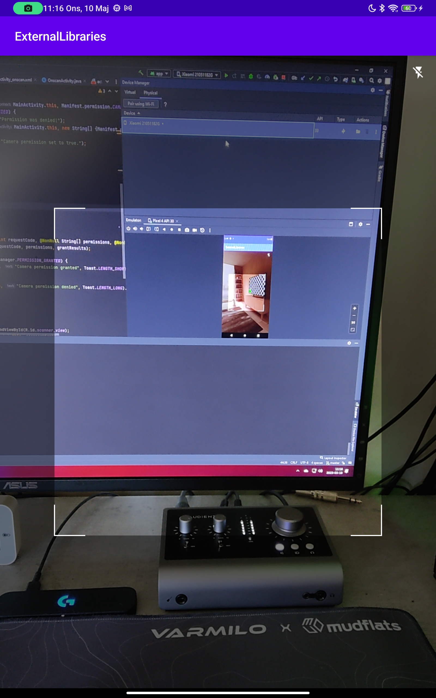
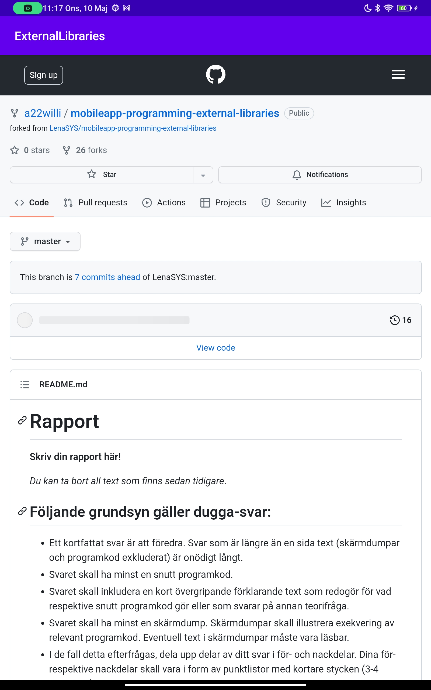

# Rapport

**Assignment 8: External Libraries**

När arbetet med externa bibliotek påbörjades var det viktigt att hitta ett bibliotek som inte är
skadligt för potentiella användare av appen. Det ska även gå att tydligt motivera varför detta 
biblioteket bör användas. 

- Ett bibliotek baserat på Xzing valdes i detta fallet ut då det är ett av de vanligaste biblioteken att använda sig av 
när det kommer till avläsning av både QR-koder och streckkoder. 
- Biblioteket är även av öppen källkod vilket innebär att det är betydligt mindre risk att det innehåller
mer än nödvändig datainsamling eller skadlig kod. 
- Länk till bibliotekets Github: https://github.com/yuriy-budiyev/code-scanner

För att påbörja projektet skapades en layout fil med en ScanView, den view där kamerans preview kommer
synas. Därefter Ändrades Manifest filen till att fråga efter tillåtelse att använda kameran. När det uppkom
problem med versionerna i appen uppdaterades de versionerna som var i konflikt med biblioteket. 

När det kom till implementationen av kodscannern skapades först en funktione som kontrollerar att appen 
har tillåtelse att använda kameran genom följande kod:
```
 if (ContextCompat.checkSelfPermission(MainActivity.this, Manifest.permission.CAMERA) == PackageManager.PERMISSION_DENIED) {
    Log.d("cameraPermission", "Permission was denied!");
    ActivityCompat.requestPermissions(MainActivity.this, new String[] {Manifest.permission.CAMERA}, 123);
} else {
    Log.d("cameraPermission", "Camera permission set to true.");
    startScanning();
}
```
Har appen de rättigheter som krävs körs funktionen startScanning som startar en ny CodeScanner från 
bibilioteket. Nedan finns koden för detta:
```
private void startScanning() {
    CodeScannerView scannerView = findViewById(R.id.scanner_view);
    codeScanner = new CodeScanner(this, scannerView);
    codeScanner.setDecodeCallback(new DecodeCallback() {
        @Override
        public void onDecoded(@NonNull final Result result) {
            runOnUiThread(new Runnable() {
                @Override
                public void run() {
                    Toast.makeText(MainActivity.this, result.getText(), Toast.LENGTH_SHORT).show();
                }
            });
        }
    });

    codeScanner.startPreview();
}
```
När CodeScanner hittat en QR-kod och skannat denna körs koden innanför onDecoded där resultatet återfinns 
som ett objekt som man sedan kan hämta den skannade datan från. 
I detta fallet väljer jag att öppna en ny activity som jag sedan skickar skannad data till. 
Denna activity innehåller en webView och öppnar därmed den URL man skannat. Det finns dock ett stort problem
med denna koden. innehåller den QR-kod man skannat inte en URL kommer fortfarande en ny webview navigera till
den "text" man skannat. 
Därefter upptäcktes det att varpå användaren navigerar tillbaka till "MainActivity" från att visa webView
återuppstartas inte kameran. Detta löstes genom att onResume() kalla på startPreview igen. 
```
@Override
protected void onResume() {
    super.onResume();
    codeScanner.startPreview();
}
```
Därefter hittades ett problem med att webbsidor inte lästes in korrekt efter skanning. Detta löstes enkelt
genom att lägga till behörighet att ansluta till internet i manifest filen. 

Resultatet av appen kan ses i bilderna nedan:

Här har jag skannat en QR-kod som jag genererat. QR-koden innehåller i detta fall en länk till detta 
github repository.
